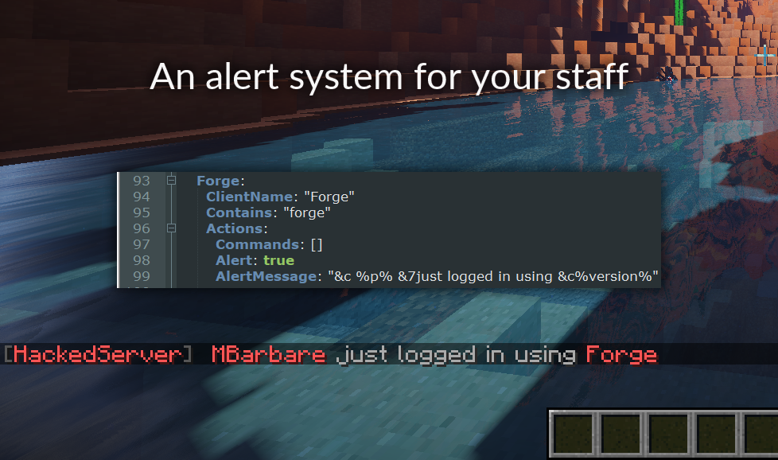

# HackedServer | Mods & Clients Detector for Minecraft

**HackedServer** is a premium Spigot/Paper plugin that detects hacked clients, cheats, and unwanted mods as players connect to your server using advanced packet-based checks.

**[Buy on Spigot →](https://www.spigotmc.org/resources/%E2%98%A0%EF%B8%8F-hackedserver-mods-clients-detector-1-16-1-21-8.46485/)** · **[Buy on Polymart →](https://polymart.org/product/630/hackedserver)** · **[Documentation →](https://docs.hackedserver.org/)**



## Features

- ✅ **Detect hacked clients early** — Run checks when players connect, before they have time to toggle cheats.
- ✅ **Wide mod & client coverage** — Detect Forge/Fabric clients, WorldDownloader, Labymod, Vape Cracked, and more (version-dependent).
- ✅ **Automatic alerts & punishments** — Alert staff or run automatic actions when suspicious clients are detected.
- ✅ **Supports modern server stacks** — Compatible with Spigot, Paper, and Bungeecord-style proxies.
- ✅ **Extensible checks** — Add your own client checks for custom setups.

## Quick Start

### Installation

1. Download `HackedServer.jar` and `HackedCore.jar` (dependency).  
2. (For 1.17+) Download `ProtocolLib`.  
3. Place the `.jar` files in your `/plugins/` folder.  
4. Restart your server.  
5. Follow the configuration guide in the docs.

**Compatibility:** Minecraft 1.16–1.21.x | Spigot & Paper (and compatible forks) | Bungeecord / Waterfall / Travertine (with proxy install)

## Website

This repository contains the **HackedServer** marketing website built with:

- Next.js 15 (App Router)
- React 19
- TypeScript 5
- Tailwind CSS
- MDX for the blog

### Local Setup

```bash
pnpm install
pnpm run dev
```

Visit `http://localhost:3000`.

### Deploy

Optimized for Vercel, with SEO metadata, sitemap, and robots.txt.

## Links

- ☠️ **Spigot:** [HackedServer on Spigot](https://www.spigotmc.org/resources/%E2%98%A0%EF%B8%8F-hackedserver-mods-clients-detector-1-16-1-21-8.46485/)
- ☠️ **Polymart:** [HackedServer on Polymart](https://polymart.org/product/630/hackedserver)
- 📚 **Docs:** [docs.hackedserver.org](https://docs.hackedserver.org/)
- 💻 **Plugin GitHub:** [oraxen/HackedServer](https://github.com/oraxen/hackedserver)
